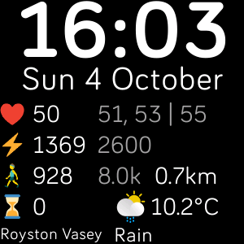

# SL Clock

A clock face for the FitBit Versa 2 smart watch.

## Building

[FitBit Documentation](https://dev.fitbit.com/build/guides/command-line-interface/)

```powershell
npm install
# then
npx fitbit-build
# or
npx fitbit
fitbit$ build
```

## Installing

```powershell
npx fitbit
# enable developer bridge on phone and watch
fitbit$ connect device
fitbit$ connect phone

# then
fitbit$ build-and-install
# or
fitbit$ bi
```

## Screen shot



Metrics are:

```text
❤️ current heart rate   1m avg, 15m avg | resting
🚶  step count today     target
⚡ calories today       target
Current Weather
Current Location
```
